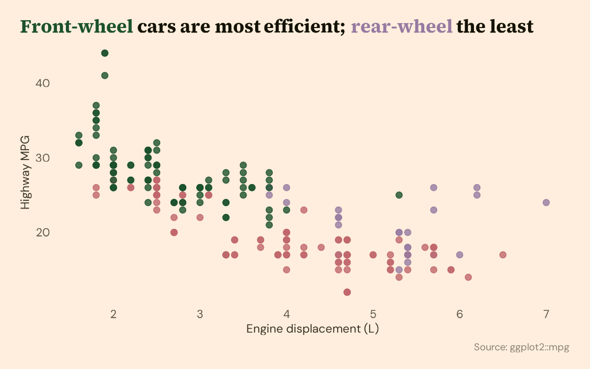

# glamour

ggplot2 themes, palettes and typography helpers for clean, directly labeled, Tufte-leaning charts.

`glamour` is a first attempt at making a cleaner chart style the easy default in ggplot2. It follows the principles in Will Chase's talk *The Glamour of Graphics* (rstudio::conf 2020): label directly instead of relying on legends, choose type on purpose, strip the grid back, and use color only when it carries meaning.



## Installation

The repository is `glamourtheming`; the package is `glamour`.

``` r
# install.packages("remotes")
remotes::install_github("James-Hodges/glamourtheming")
```

## Example

``` r
library(ggplot2)
library(glamour)

load_glamour_fonts()  # registers Source Serif 4 and DM Sans via showtext
pal <- glamour_palette("warm")

ggplot(mpg, aes(displ, hwy, color = drv)) +
  geom_point(alpha = 0.8, size = 2.5) +
  scale_color_manual(values = c(f = pal[["accent1"]], r = pal[["accent2"]], `4` = pal[["accent3"]])) +
  labs(
    title = paste(
      color_label("Front-wheel", pal[["accent1"]]), "cars are most efficient;",
      color_label("rear-wheel", pal[["accent2"]]), "the least"
    ),
    x = "Engine displacement (L)", y = "Highway MPG"
  ) +
  theme_glamour(palette = "warm", legend = "none")
```

## What's included

| Function | Purpose |
|---|---|
| `theme_glamour()` | Minimal theme with controls for the grid, legend, palette and fonts |
| `glamour_palette()`, `show_palette()`, `show_all_palettes()` | Three named palettes (`warm`, `slate`, `midnight`) with background, ink and accent colors |
| `scale_color_glamour()`, `scale_fill_glamour()` | Discrete scales built from a palette |
| `color_label()`, `color_legend()` | Color words in a title or subtitle so the legend can go |
| `glamour_label()` | Direct labels in the theme's typography |
| `load_glamour_fonts()`, `glamour_fonts()` | Register and reference the theme's Google Fonts |
| `glamour_save()` | Save plots with consistent sizing and resolution |

A rendered gallery of scatter, bar, line and faceted examples is in [`examples/demo.qmd`](examples/demo.qmd) and on [jameshodges.cc](https://jameshodges.cc/projects/glamour-theming/).

## License

MIT © James Hodges
